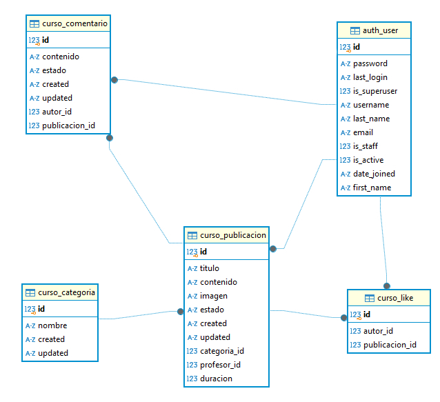

# INFORMACIÓN DEL PROYECTO
## Integrante: Limbert Olmos Mercado

## 1. Diagrama E-R:Tablas utilizadas


## 2. Su Aplicación debe tener al menos 4 Models (Modelos o Tablas) 
Archivo: models.py
```bash
from django.db import models
from .validators import validar_numeros_positivos, validar_longitud_minima, validar_longitud_maxima, validar_numeros_valor_maximo
from django.contrib.auth.models import User
import uuid
import os


def unique_image_path(instance, filename):
    ext = filename.split('.')[-1]
    filename = f"{uuid.uuid4().hex}.{ext}"
    return os.path.join('imagenes/', filename)

class Estados(models.TextChoices):
    Activo = 'Activo'
    Inactivo = 'Inactivo'

class Categoria(models.Model):
    nombre = models.CharField(
        max_length=100,
        validators=[validar_longitud_minima, validar_longitud_maxima],
    )
    created = models.DateTimeField(auto_now_add=True)
    updated = models.DateTimeField(auto_now=True)
    
    def __str__(self):
        return self.nombre
    
class Publicacion(models.Model):
    titulo = models.CharField(
        max_length=255,
        validators=[validar_longitud_minima, validar_longitud_maxima], 
    )
    contenido = models.TextField()
    duracion = models.IntegerField(
        validators=[
            validar_numeros_positivos, validar_numeros_valor_maximo,
        ], 
        help_text="Duración en minutos",
    )
    imagen = models.ImageField(max_length=200, upload_to=unique_image_path, blank=True, null=True)
    estado = models.CharField(max_length=10, choices=Estados.choices, default=Estados.Activo)
    categoria = models.ForeignKey("Categoria", on_delete=models.CASCADE)
    profesor = models.ForeignKey(User, on_delete=models.CASCADE)
    created = models.DateTimeField(auto_now_add=True)
    updated = models.DateTimeField(auto_now=True)
    
    def __str__(self):
        return self.titulo
    
class Comentario(models.Model):
    contenido = models.TextField(
        validators=[validar_longitud_minima],
    )
    estado = models.CharField(max_length=10, choices=Estados.choices, default=Estados.Activo)
    publicacion = models.ForeignKey("Publicacion", on_delete=models.CASCADE)
    autor = models.ForeignKey(User, on_delete=models.CASCADE)
    created = models.DateTimeField(auto_now_add=True)
    updated = models.DateTimeField(auto_now=True)
    
    def __str__(self):
        return f"Comentario por {self.autor} en {self.publicacion}"
    
class Like(models.Model):
    publicacion = models.ForeignKey("Publicacion", on_delete=models.CASCADE)
    autor = models.ForeignKey(User, on_delete=models.CASCADE)
    
    class Meta:
        unique_together = ('publicacion', 'autor')
    
    def __str__(self):
        return f"Like por {self.autor} en {self.publicacion}"
```

## 3. Sus Models deben contener al menos 2 validaciones personalizadas
Archivo: validators.py
```bash
from django.core.exceptions import ValidationError

def validar_numeros_positivos(value):
    if value <= 0:  # Verifica que el valor sea mayor o igual a 1
        raise ValidationError(
            f'Este campo debe tener un valor igual o mayor a 1.',
            params = {
                'value': value,
            }
        )

def validar_numeros_valor_maximo(value):
    if value > 180:  # Verifica que el valor sea mayor o igual a 1
        raise ValidationError(
            f'Este campo debe tener maximo de 180.',
            params = {
                'value': value,
            }
        )
        
def validar_longitud_minima(value):
    if isinstance(value, str) and len(value.strip()) < 6:  # Verifica que tenga al menos 3 caracteres
        raise ValidationError(
            f'Este campo debe contener al menos 6 caracteres.',
            params={'value': value},
        )

def validar_longitud_maxima(value):
    if isinstance(value, str) and len(value.strip()) > 100:  # Verifica que tenga al menos 3 caracteres
        raise ValidationError(
            f'Este campo debe contener maixmo 100 caracteres.',
            params={'value': value},
        )
```

## 4. Su Administrador de Django debe tener al menos 2 Models registrados 
Archivo: admin.py
```bash
from django.contrib import admin
from .models import Categoria, Publicacion, Comentario

class CategoriaAdmin(admin.ModelAdmin):
    list_display = ('nombre', 'fecha_registro')
    ordering = ('nombre',)
    search_fields = ('nombre',)
    
    def fecha_registro(self, obj): 
        return obj.created 
    fecha_registro.short_description = 'Fecha Registro'
    
admin.site.register(Categoria, CategoriaAdmin)

class PublicacionAdmin(admin.ModelAdmin):
    list_display = ('titulo', 'duracion', 'estado', 'categoria', 'profesor')
    ordering = ('titulo',)
    search_fields = ('titulo',)
    list_filter = ('estado',)

admin.site.register(Publicacion, PublicacionAdmin)

class ComentarioAdmin(admin.ModelAdmin):
    list_display = ('contenido', 'autor', 'estado', 'publicacion', 'fecha_registro')
    ordering = ('-created',) # Orden descendente por el campo 'created' es con '-created'
    search_fields = ('contenido',)
    list_filter = ('estado',)
    
    def fecha_registro(self, obj): 
        return obj.created 
    fecha_registro.short_description = 'Fecha Registro'
    
admin.site.register(Comentario, ComentarioAdmin)
```

## 5. Utilice Django Rest Framework para crear al menos 3 ModelViewSet o GenericAPIView 
Archivo: admin.py (CategoriaViewSet, PublicacionViewSet, PublicacionListView)
```bash    
# Para ModelViewSet   
class CategoriaViewSet(viewsets.ModelViewSet):
    queryset = Categoria.objects.all()
    serializer_class = CategoriaSerializer
    
class PublicacionViewSet(viewsets.ModelViewSet):
    queryset = Publicacion.objects.all()
    serializer_class = PublicacionSerializer

# Para GenericAPIView
class PublicacionListView(generics.ListAPIView):
    serializer_class = PublicacionSerializer

    def get_queryset(self):
        return Publicacion.objects.filter(estado='Activo')
    
```

## 6. Utilice Django Rest Framework para crear al menos 1 Custom API 

```bash
# Para Custom API
@api_view(["GET"])
def categoria_count(request):
    try:
        categorias = Categoria.objects.all()
        data = []

        for categoria in categorias:
            publicaciones_count = Publicacion.objects.filter(categoria=categoria).count()
            data.append({
                "categoria": categoria.nombre,
                "publicaciones_count": publicaciones_count,
            })

        return JsonResponse(data, safe=False, status=200)
    except Exception as e:
        return JsonResponse({"error": str(e)}, safe=False, status=500)
```

## 7. Debe incluir el archivo requirements.txt en la raíz del repositorio  

```bash
pip freeze > requirements.txt
```
